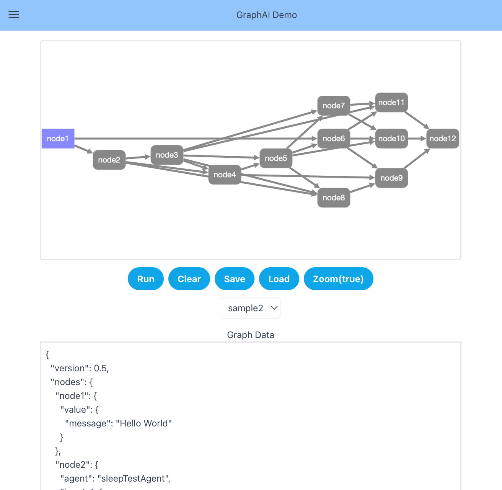

# GraphAI Web Demo Application

This demonstrates the scale and capacity of GraphAI



# Usage

### install npm packages

```
yarn install
```

### run vue

```
yarn run serve
```

## optional

If you use OpenAI from a browser for chat or reception.

```
VITE_OPEN_API_KEY=sk-xxx yarn run serve
```

If you use a server with reception

```
git clone https://github.com/receptron/graphai-agent-server.git
```

run server
```
yarn run server
```